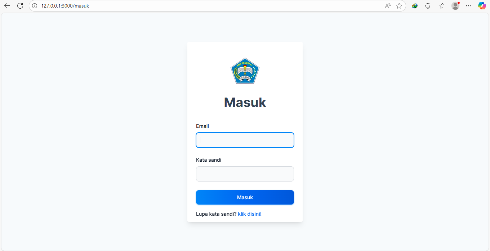
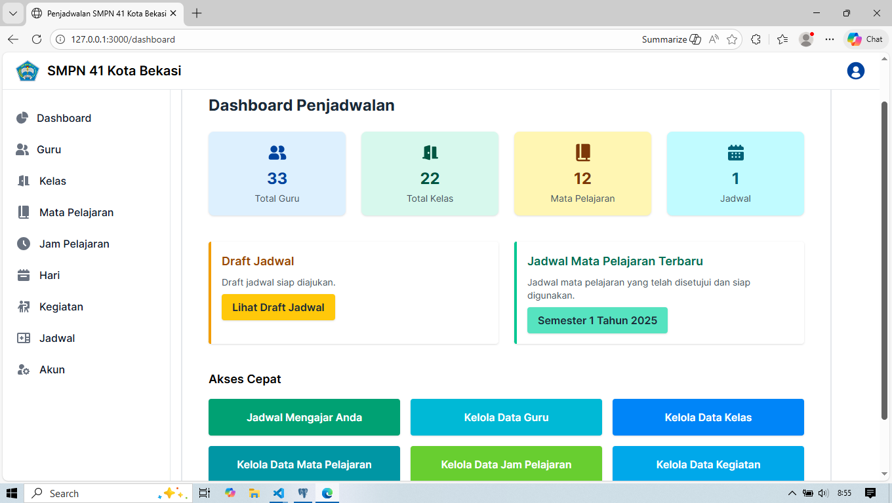
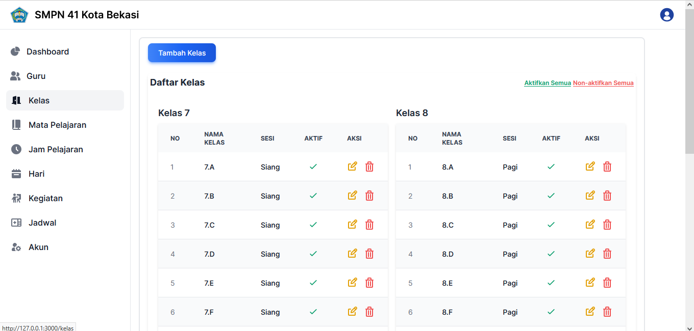
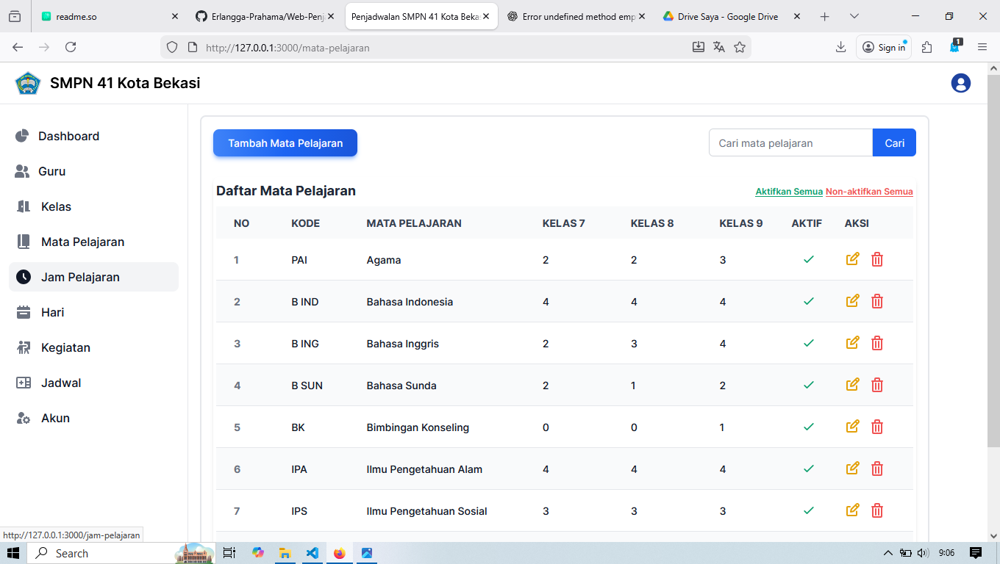
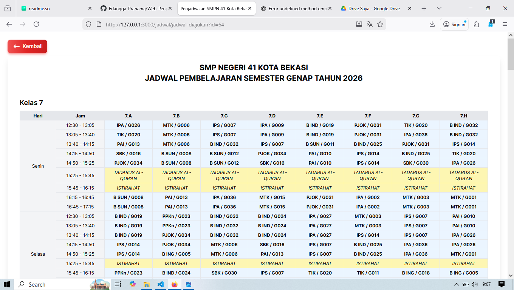
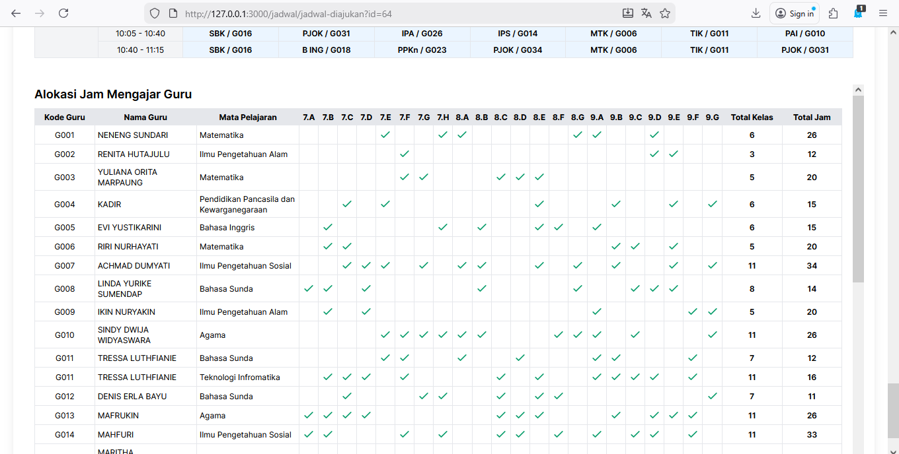
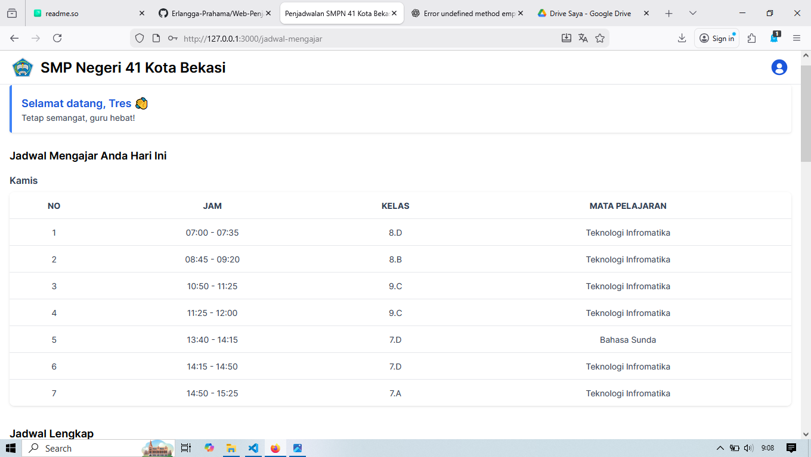

# Sistem Informasi Sekolah

Aplikasi web untuk mengelola dan menghasilkan jadwal pelajaran sekolah. Sistem ini dirancang untuk membantu pihak sekolah dalam mengatur jadwal kelas, guru, mata pelajaran, serta berbagai aturan dan pembatasan penjadwalan.

## 🚀 Fitur 

* Manajemen data guru, kelas, mata pelajaran, dan jam pelajaran
* Penyusunan jadwal pelajaran **otomatis menggunakan Algoritma Genetika**
* Dukungan pembatasan guru (hari/jam tidak mengajar, cuti)
* Pengajuan, preview, persetujuan, dan finalisasi jadwal
* Tampilan jadwal khusus untuk guru (hanya jadwal mengajar masing-masing)
* Role-based access (Guru, Waka Kurikulum, Kepala Sekolah)

## 🛠️ Teknologi yang Digunakan

* **Bahasa**: Ruby 3.3.4
* **Framework**: Ruby on Rails 7.1.3
* **Database**: PostgreSQL
* **Frontend**: Tailwind CSS & Flowbite
* **Hotwire**: Turbo & Stimulus
* **Algoritma**: Genetic Algorithm (Penjadwalan Pelajaran)

## 📦 Prasyarat

Pastikan environment berikut sudah terpasang:

* Ruby >= 3.3.4
* Rails >= 7.1.3
* Node.js & Yarn / npm
* PostgreSQL
## ⚙️ Instalasi

1. Clone repository

   ```bash
   git clone https://github.com/Erlangga-Prahama/Web-Penjadwalan-Ruby-on-Rails.git

   cd Web-Penjadwalan-Ruby-on-Rails
   ```

2. Install dependency

   ```bash
   bundle install
   ```

3. Setup database

   ```bash
   rails db:create
   rails db:migrate
   rails db:seed
   ```

4. Jalankan server

   ```bash
   rails server
   ```

5. Akses aplikasi melalui browser

   ```
   http://localhost:3000
   ```

## 👤 Role & Hak Akses

* **Guru**

  * Melihat jadwal mengajar pribadi

* **Waka Kurikulum**

  * Mengelola data guru, mata pelajaran, dan kelas
  * Membuat, mengajukan, dan menghapus jadwal
  * Menjalankan proses penjadwalan otomatis

* **Kepala Sekolah**

  * Melihat seluruh data yang dikelola waka kurikulum
  * Menyetujui jadwal yang diajukan

## 🧠 Alur Singkat Sistem

1. Waka kurikulum menginput dan mengelola data master 
2. Waka kurikulum menjalankan algoritma genetika untuk menghasilkan draft jadwal
3. Sistem melakukan validasi konflik dan constraint
4. Jadwal diajukan kepada kepala sekolah
5. Kepala sekolah menyetujui atau menolak jadwal
6. Guru dapat melihat jadwal mengajar yang telah disetujui


## 📸 Screenshot















Dikembangkan oleh **Erlangga Prahama Yuda**
